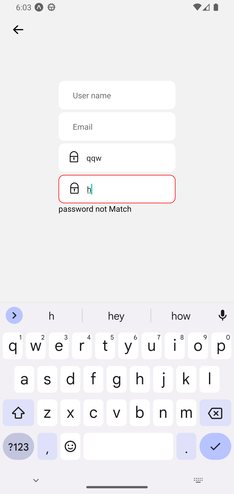
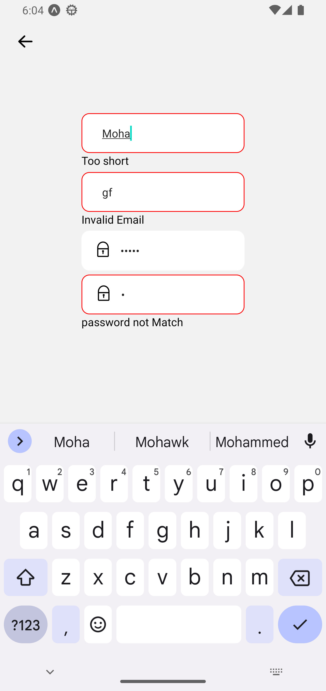
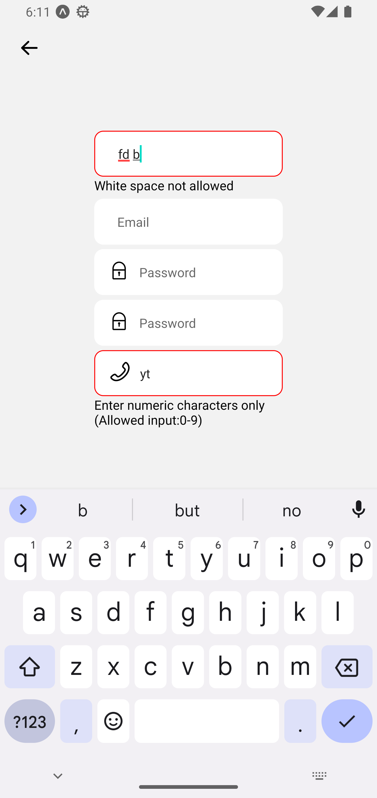
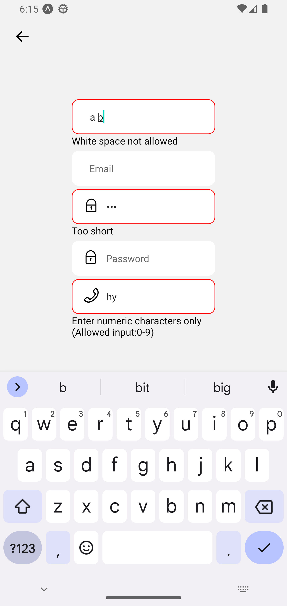
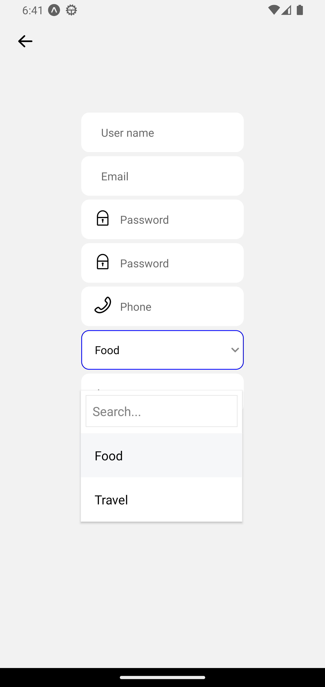
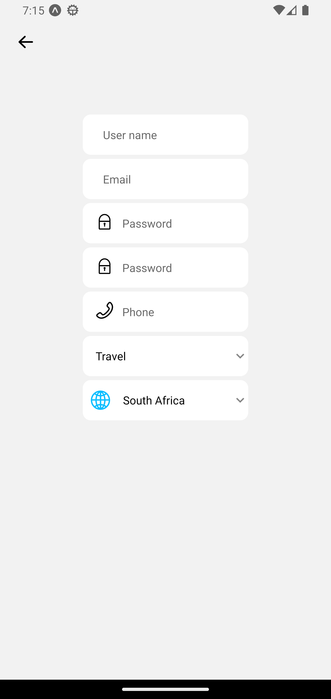

# React native Custom components

- React native Expo
- Typescript
- Custom components

# Installation

```
git clone
cd component
yarn
expo start
```

# Screenshots

<tr>
<td>

</td>
<td>

</td>

<td>
</td>
<!-- 2 -->
<td>

</td>
<td>

</td>

<td>
</td>
<!-- 3 -->
<td>

</td>

<td>
<td>

</td>
</td>
<!-- 4 -->
<td>

</td>

</td>

</tr>
